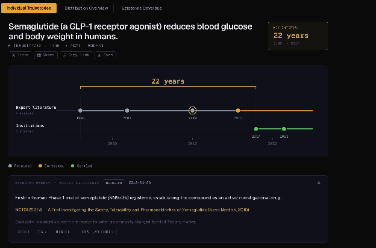

# Epistemic Receipts: Understanding the Configuration of Knowledge

Robert Contofalsky · Ph.D. Student
Epistemic Receipts White Paper · July 1, 2026

## Introduction & Motivation

Information is not static and does not live in a vacuum. Whether that is scientific papers, breaking news stories, what is happening at your local cafe, or who is winning the World Cup. All things point to the same trajectory: information has a *trajectory* that tells a story that has a beginning and an ending. This story can be ongoing, settled, or disputed. Regardless of its status, all of it has a place within time and is ongoing through time. Every event has antecedents (causes, conditions, precursors) and consequences (effects, reactions, follow-on events), even when we can't trace them fully or choose not to.

Nothing – fact, verdict, or belief – enters the written record as a singular event. A drug approval, court ruling, scientific consensus, or even a space launch all have a history of claims that preceded them, and a future investigation that will revise, confirm, or overturn them. The moment of consensus is not the end of the story, but merely a snapshot of the ongoing one.

Settled facts can feel inert, but they are not. Everyone knows that smoking causes cancer, but looking at the fact-record of this claim reveals more of a process than a simple Yes/No binary. The U.S. Surgeon General publicly declared that smoking *causes* cancer [1]; however, studies investigating the association between lung cancer and smoking date back to the 1930s [2]. Why does such a discrepancy between *expert literature* and *institutional literature* exist? Common wisdom states that "Big Tobacco" lobbies are the primary cause for this information suppression; however, this is a shallow story that abdicates responsibility onto information distributors. The knowledge of heavy tobacco smokers having higher rates of lung cancer *was* "out there," and it was not exclusive to the scientist's laboratory. Indeed, medical doctors were aware that patients who had lung cancer were more likely to be heavy smokers. And each individual patient who entered their office with lung cancer and as a heavy smoker was an individual information-trajectory of this knowledge. Whether this was suppressed, ignored, or empirically validated are merely human *attitudes* towards the information, not the information itself.

This distinction matters because acquired knowledge (and, to a lesser degree, access to knowledge) is the determinant of decision-making. If the information-trajectory exists *independently* of the attitudes taken toward it, then access to that trajectory – not access to a verdict – is what determines who can act on knowledge and who is left reacting to someone's summary of it. Of course, this is not a repudiation of expert consensus or of scientific or medical practitioners – quite the opposite – but merely a framework for how to present knowledge, because not all information is the same. Regarding the latter point, a scientific study needs to be replicated many times before it can be deemed "consensus," and a doctor must be citing consensus-literature as opposed to a niche case-study they read on PubMed that day. Even in medicine it is recognized that the double-blind Randomized Controlled Trial is the "Gold Standard" of evidence. This is an indirect confirmation that *not all* evidence is equal. However, evidence is out there *regardless* of standard, and it also has a trajectory. Often it is the case that case-studies turn into randomized controlled trials (though this is definitely not the norm). For example, Barry Marshall's 1984 self-experiment, in which he drank a culture of H. pylori to prove it caused gastritis, was itself a single-patient case study that within a year secured funding for the double-blind RCT confirming antibiotics cured peptic ulcers – a finding that eventually earned a Nobel Prize [3]. All this to say that facts and claims about the world exist within time, and have a certain trajectory to them. These facts can be traced, and if they are important enough, expand into something bigger. Going back to Marshall, each stage in his Nobel Prize acquisition has an arc: the self-experiment, the funding decision, the trial data, the changed standard of care – all are receipts that are **dated and sourced as a record of what was known, by whom, and how confidently at that exact moment.** A hierarchy of evidence doesn't erase this record; it's layered onto it, one receipt at a time. That is the premise this paper builds on: a fact is not a verdict handed down once, but a chain of receipts accumulating over time – and Epistemic Receipts exists to make that chain visible.

## Problem It Aims to Solve — the Curious Person in the Bookstore (Abundance and Source Grading)

As of July 1st, 2026, it is not controversial to say that there is more information accessible than one knows what to do with. In fact, the problem is *worse* than that. There are more *information* tools than one knows what to do with as well. Want to read about the Vietnam War? You can read about it on Wikipedia, or pick up a book out of 30,000, watch a documentary (on top of deciding *where* to watch it: YouTube? CBS? PBS? CNN? History Channel? Good luck!), take a university course, or even use AI (but which model?). While all sources are valid, they are not equal, and all produce radically different outcomes in terms of knowledge acquired. Additionally, they put the burden on the curious person to "figure out" what is in the book and how to get the relevant information they want out of it. While fair, this is not a fault of the delivery mechanism; it is a burden nonetheless. A burden that is costly to one's time, and even counterproductive to learning itself. If you never knew what a jungle firefight was, would you benefit more from seeing it visually – like from a documentary – or from using your imagination by reading?

But the problem is deeper than this: none of this is organized. If you are a curious person wanting to know about the Vietnam War, how do you know what to choose and where to start? Each day during that war can have a book written about it, its antecedent events, who mattered, and so on. Do you then choose comprehensive or non-comprehensive? Do you choose something more global, local, or geopolitical? Hard to say – this then becomes a question of ontology about *what* the person wants to learn about. But again, Epistemic Receipts is about a framework of information presentation and organization, whereas finding a book to read is about deciding which to commit to and then having to either commit or abandon – which can be hard as an ignorant user.

Epistemic Receipts does not solve that problem – it does not tell the curious person which book to buy or which documentary to watch, and no framework reasonably could. What it does instead is orthogonal to format entirely: it tells the reader where the underlying claims stand, independent of which source delivers them. Whichever book on the Vietnam War someone picks up, it will contain hundreds of individual claims – some settled across the historical record, some a single historian's contested interpretation, some unresolved – and the book itself can omit which is which. The curious person doesn't need a better book; they need a way to check the claims against a trajectory of when the facts happened.

(To be clear, Epistemic Receipts does not aim to replace books or scholarly investigations. Instead, it's a presentation style of what the facts are and how they evolved over time. In short, it's providing the context and allowing the user to both choose and ignore certain sources that might not be relevant to them.)

## How to Solve the Curious-Bookstore-Person Problem

Consider the case of Ozempic. News stories about Ozempic spiked in 2023–2026 because it was being celebrated as a revolutionary weight-loss drug – which it is. Indeed, reverse-engineering hunger signals as a method to reduce obesity is clever, but should it have gotten the attention in 2023? And how novel is this drug really? Enter the Epistemic Receipts case study [figure 1; 4].

*Figure 1. The semaglutide (GLP-1 receptor agonist) trajectory as an Epistemic Receipt. The claim "semaglutide reduces blood glucose and body weight in humans" is traced across 22 years — from expert literature (1996, 2001, 2010, 2015) to institutional approvals (2017, 2021) — with each point a dated, sourced receipt color-coded by status (receded / contested / settled).*

We can see that Ozempic was actually published in *Nature* in 1996, when it reduced weight in mice; then again in 2001; then in 2010 as a Phase 1 trial; followed by 2017, when it was FDA-approved for type 2 diabetes; and then 2021 as a weight-loss drug. Traditionally, to figure out this trajectory you would have had to search it in either a scholarly search engine or a regular search, then read articles or news print about it to get a better idea. But here, we have consolidated this into one page and given direct access to the scientific papers that report these findings – completely bypassing the middleman of a news agency that might otherwise exist and not tell the full story (no offense).

While seemingly minute, this representation of knowledge is a major shift toward a new paradigm. Instead of having to search or read extensively through papers to come across the information, users can simply interact with the website and then see the receipts of the claims and how they evolved. The advantages of this are that the receipts are loyal to the source material (all sources are academic in this case), and that they can be consulted more cohesively than finding the papers individually. It is a well-known fact that in science there are "too many things to read," and it is an art to know "which papers are good [and which are not]." Furthermore, search can now be infused with this linking type of process.

This already exists in miniature: the retraction-explorer feature tracks over 26,600 retracted papers via CrossRef and traces their citation half-life – how long, and how often, a paper kept being cited after it was formally withdrawn. That's the same receipt logic applied to a paper's death rather than a claim's birth: a dated, sourced record of when the scientific community said "this was wrong," and how long it took the rest of the literature to notice.

## Conclusion

Return to where this paper started: information does not enter the record as a single event, it enters as a trajectory, and every claim carries a history of what came before it and what will come after. Semaglutide is that thesis compressed into one figure. A mouse study in 1996, a rat study in 2001, a first-in-human trial in 2010, an FDA approval for diabetes in 2017, an FDA approval for weight loss in 2021 – five receipts, thirty years, one continuous claim – arrived in most people's field of view as a single event in 2023. That gap between when a fact enters the record and when it enters public attention is not a footnote to the tobacco and H. pylori examples in the introduction; it is the same gap, playing out in real time, on a drug most readers have already formed an opinion about.

The curious-person-in-the-bookstore problem and the Ozempic case study are the same problem from two directions. The bookstore problem is too many unequal, unorganized sources with no way to check what any of them are actually claiming. The Ozempic case is what happens when that check never occurs: a claim gets a single, flattened moment of attention – "novel weight-loss drug" – instead of the trajectory that produced it, and both its history and its open questions disappear from view. Epistemic Receipts does not resolve this by producing a better book, a better documentary, or a better news segment. It resolves it by making the claim beneath any of those formats checkable on its own terms: dated, sourced, and staged, from first recorded observation to institutional settlement, with the primary documents one click away.

The stakes are not really about any one drug, ruling, or retracted paper. They are about whether a person encountering a claim for the first time – in a headline, a doctor's office, a search result – has any way to tell where that claim sits on its own timeline, or whether they are stuck taking someone else's word for it. Acquired knowledge is what allows a person to decide for themselves; access to a claim's trajectory, rather than access to whoever last summarized it, is what makes that knowledge acquirable in the first place. That is what Epistemic Receipts is for.

## Current State of the DB

As of writing, Epistemic Receipts holds 1,625,084 claims drawn from 174 distinct sources across seven categories. By volume, the largest categories are national parliaments and legislation (86 sources, 405,391 claims – mostly foreign statute registries: Hungary, Argentina, the Czech Republic, Italy, and dozens more), science and medicine (26 sources, 488,285 claims, anchored by 318,775 OpenAlex papers and 26,624 CrossRef retractions), and US federal government records (18 sources, 358,640 claims, dominated by NARA's declassified catalog and Voteview's congressional roll-calls back to 1789). Courts and legal (14 sources, 15,896 claims), international organizations (12 sources, 134,485 claims), pharmaceutical and health (10 sources, 147,880 claims), and archives and historical collections (8 sources, 69,074 claims) round out the registry.

Nearly all of this is reference-claim scaffolding: bulk-imported, machine-ingested, structurally sound, but not individually curated into a receipt-by-receipt narrative. The claims that actually demonstrate this paper's argument – semaglutide, Korematsu, the tobacco memo, Pluto's reclassification – don't live in that bulk layer. They sit under a handful of hand-tagged seed collections (seed:medicine-trajectories, seed:human-history-trajectories, and similar), a few thousand claims out of 1.6 million. That imbalance is the honest state of the project: the schema to hold a claim's trajectory at scale already exists, but turning a bulk record into a fully-sourced case study is still manual labor, and still the bottleneck.

## What It Can Solve in the Future

The near-term ceiling is not more data, it's more receipts per claim. Three directions follow directly from the current bottleneck. First, semi-automated trajectory construction: using the existing bulk layer (OpenAlex citation graphs, CrossRef retraction links, ClinicalTrials.gov registrations) to auto-draft candidate trajectories for a claim, with a human curator confirming rather than assembling from scratch – the same leverage a research assistant gives a scholar, applied to the ingestion pipeline itself. Second, reversal-tracking beyond retraction: the retraction-explorer already handles the loud case – a paper formally withdrawn, flagged by CrossRef, with a citation trail you can trace afterward. The harder and more common case is quiet reversal – a finding that is never retracted, just gradually stops being cited, gets contradicted by a later meta-analysis, or fails to replicate without anyone issuing a correction. Detecting that kind of reversal means modeling a claim's citation trajectory over time, not just checking a retraction flag, and it's the natural next extension of the same infrastructure that already tracks semaglutide's trajectory from mouse study to FDA approval. Third, cross-domain linking: a court ruling that leans on a scientific claim, or a bill whose sponsorship cites a study, currently sit in separate categories with no typed relation between them. Connecting a legal or legislative claim to the scientific trajectory it depends on would let a reader check not just "is this claim settled" but "is the thing this ruling was built on still standing."

Longer term, the more interesting use is not a person browsing the site directly but other tools querying it – an AI assistant or search engine that, instead of returning a flattened answer, cites a claim's actual current status and lets the user see the receipt. That would make Epistemic Receipts less a destination and more an infrastructure layer other systems check against before stating something as settled.

## Homage to Information and the Future of Scholarship

None of this is a new idea. It's a continuation of the oldest habit in scholarship: cite your source, and let the reader verify it. The footnote, the bibliography, the marginal gloss on a medieval manuscript, the Talmudic page with commentary layered around commentary across centuries of disagreement – all of these are receipt systems, built by hand, long before the word "database" existed. What has changed is not the impulse but the scale: a citation apparatus that once lived in a single scholar's footnotes, checkable only by someone with access to the same library, can now be built once and checked by anyone, instantly, across a million claims instead of one paper's worth.

This paper does not claim to replace that tradition. It claims to make its central habit – show your work, date your claim, let it be checked – available outside the expert's office and the paywalled journal, without asking the reader to first become an expert themselves. Scholarship has always known that a fact is not the end of an inquiry but a position in one. Epistemic Receipts is an attempt to make that position visible to anyone who asks, not just the small number of people trained to go looking for it.

## Author Bias & Inspiration

Acknowledgement of bias and personal motivation is important, so it will be disclosed here. Most importantly, the idea of consensus taking time and being socially verified comes from Steven Pinker's work on common knowledge. Second, OSINT tools like Flightradar, boat radar, and the like are exactly the type of receipt that helps you understand what is going on, and they are neutral – the neutrality is most important. Ground News is a third, as it helped me understand how wide the range of the reporting of facts can be. Fourth, the fact that news cycles do not follow through, and focus only on what is in the now, is extremely frustrating and disingenuous to the idea that news is not one thing.

## Sources

**[1]** Surgeon General's 1964 report — smoking causes cancer.

- Harvard Health: <https://www.health.harvard.edu/blog/surgeon-generals-1964-report-making-smoking-history-201401106970>
- E-R link: <https://epistemic-receipts.vercel.app/claims/cmqwoxe6l07dy8o0y6xrs8xnv>

**[2]** Studies on lung cancer and smoking dating back to the 1930s.

- PMC: <https://pmc.ncbi.nlm.nih.gov/articles/PMC3640840/pdf/nihms455570.pdf>
- E-R link: <https://epistemic-receipts.vercel.app/claims/cmqoappnu03yxsadpa90nu942>

**[3]** Barry Marshall's H. pylori self-experiment (Nobel Prize).

- PubMed: <https://pubmed.ncbi.nlm.nih.gov/3982345/>

**[4]** Semaglutide / GLP-1 settling curve (case-study figure).

- E-R settling curve: <https://epistemic-receipts.vercel.app/settling-curve?t=semaglutide-glp1>

Primary sources for the semaglutide trajectory (chronological):

- Turton MD, et al. "A role for glucagon-like peptide-1 in the central regulation of feeding." *Nature*. 1996;379(6560):69–72. <https://www.nature.com/articles/379069a0>
- Larsen PJ, Fledelius C, Knudsen LB, Tang-Christensen M. "Systemic administration of the long-acting GLP-1 derivative NN2211 induces lasting and reversible weight loss in both normal and obese rats." *Diabetes*. 2001;50(11):2530–9. <https://pubmed.ncbi.nlm.nih.gov/11679426/>
- NCT01262118 — "A Trial Investigating the Safety, Tolerability and Pharmacokinetics of Semaglutide" (Novo Nordisk, 2010). <https://clinicaltrials.gov/ct2/show/NCT01262118>
- Lau J, et al. "Discovery of the Once-Weekly GLP-1 Analogue Semaglutide." *J Med Chem*. 2015;58(18):7370–80. <https://pubmed.ncbi.nlm.nih.gov/26308095/>
- FDA Approval NDA 209637 — Ozempic (semaglutide injection) for Type 2 Diabetes (December 5, 2017). <https://www.accessdata.fda.gov/drugsatfda_docs/appletter/2017/209637Orig1s000ltr.pdf>
- FDA Approval NDA 215256 — Wegovy (semaglutide injection 2.4 mg) for Chronic Weight Management (June 4, 2021). <https://www.accessdata.fda.gov/drugsatfda_docs/appletter/2021/215256Orig1s000ltr.pdf>
